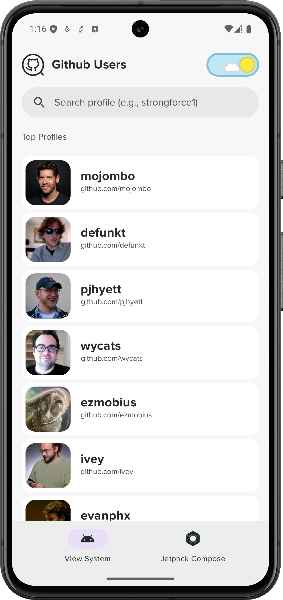
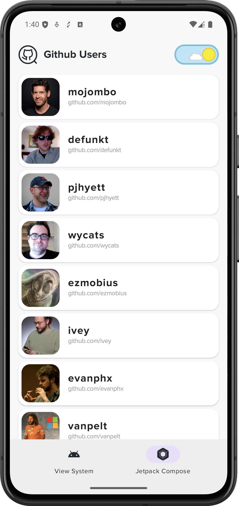
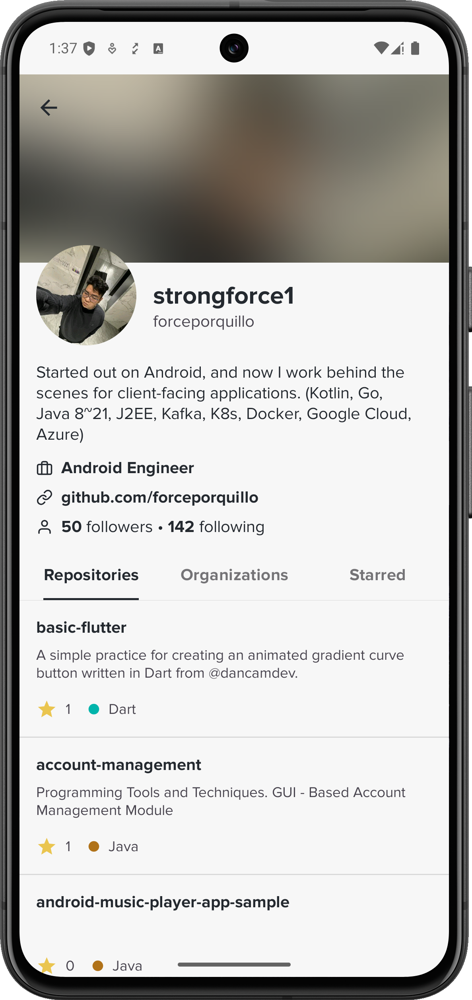
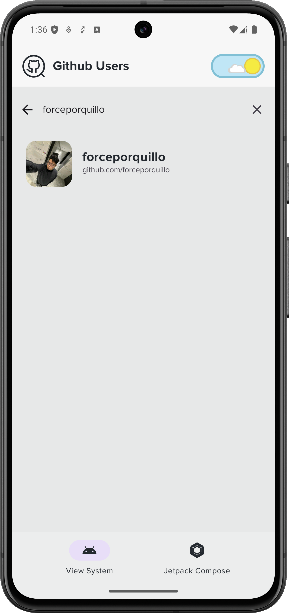
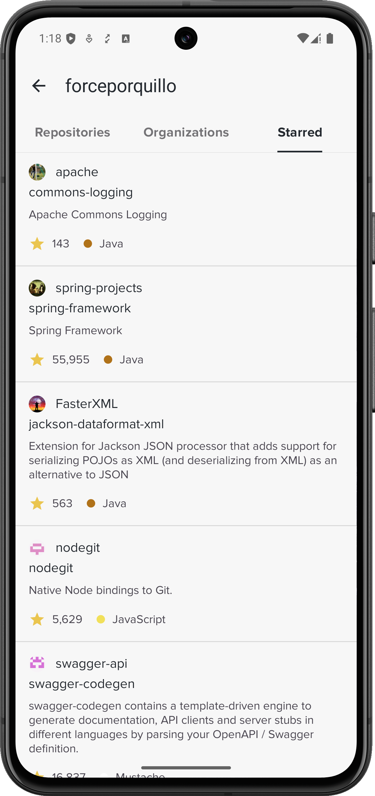
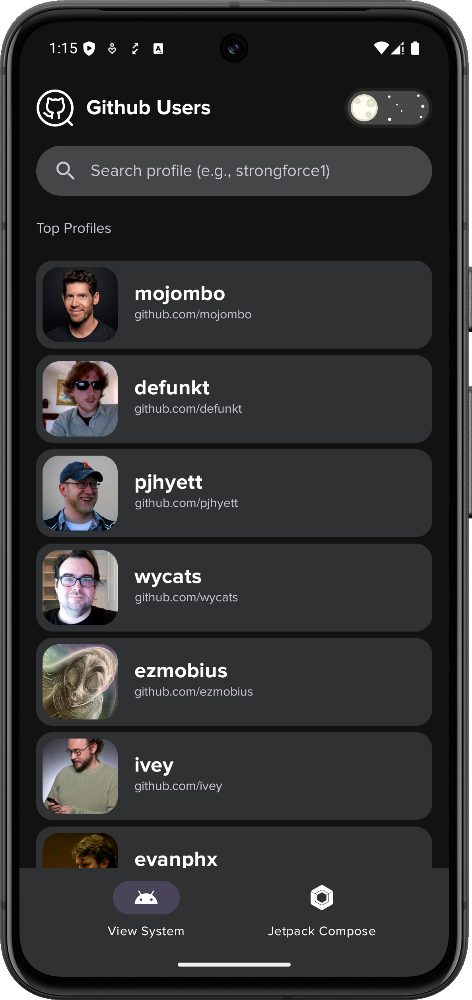
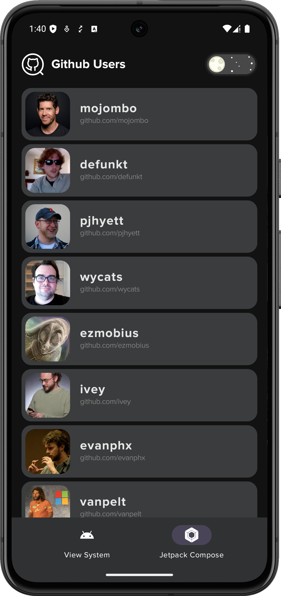
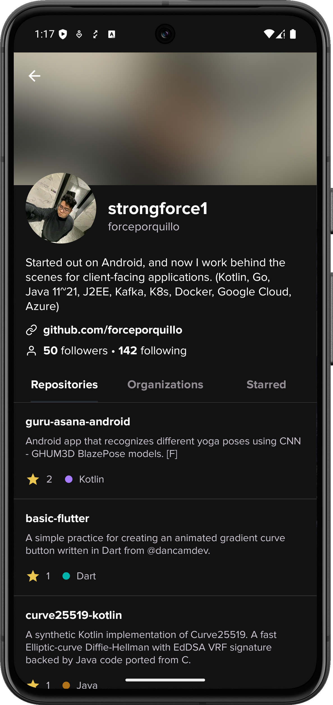
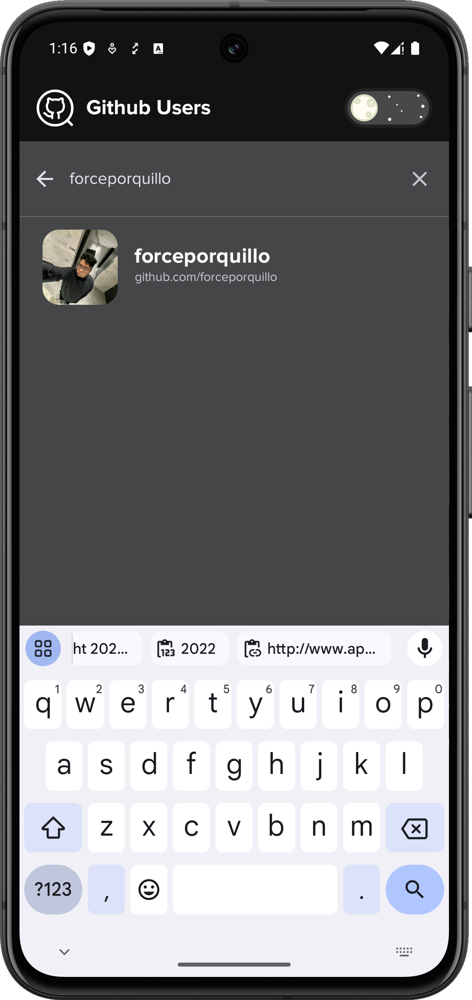
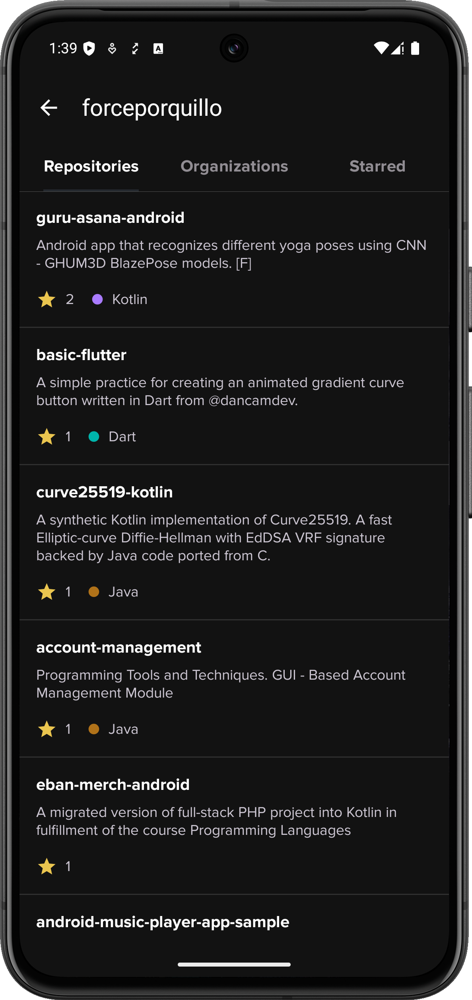

<h1 align="center">Github Profile</h1>
:octocat: <strong>GitProfile</strong> is an Android application that allows users to search for GitHub users, view their details, repositories, starred repositories, and organizations. The app uses modern Android development practices and libraries to provide a smooth and efficient user experience.

## Features
- [x] Search for GitHub users by name.
- [x] View detailed information about users.
- [x] Browse user repositories.
- [x] View starred repositories of users.
- [x] Check organizations that users belong to.
- [x] Pagination support for loading more data.
- [x] Offline caching of user data.
- [x] Dark mode support.
- [ ] View user repository details.
- [ ] SearchBar in Compose tab.
- [ ] Swipe to refresh in Compose tab.

## Previews
### Light Mode ☀️
|  |  |  |  |  |
|-------------------------------------------------------------------------------------|-------------------------------------------------------------------------------------|-------------------------------------------------------------------------------------|-------------------------------------------------------------------------------------|-------------------------------------------------------------------------------------|
| <p align="center">XML Layout</p>                                                    | <p align="center">Compose Screen</p>                                                | <p align="center">User Details</p>                                                  | <p align="center">Search User</p>                                                   | <p align="center">Starred Repositories</p>                                          |

### Dark Mode 🌑
|  |  |  |  |  |
|-------------------------------------------------------------------------------------|-------------------------------------------------------------------------------------|-------------------------------------------------------------------------------------|-------------------------------------------------------------------------------------|-------------------------------------------------------------------------------------|
| <p align="center">XML Layout</p>                                                    | <p align="center">Compose Screen</p>                                                | <p align="center">User Details</p>                                                  | <p align="center">Search User</p>                                                   | <p align="center">User Repositories</p>                                             |

## Technologies and Frameworks

- **Dagger Hilt**: Dependency injection library for Android.
- **Retrofit**: Type-safe HTTP client for Android and Java.
- **Kotlin**: Programming language used for Android development.
- **Coroutines**: Concurrency design pattern that you can use on Android to simplify code that executes asynchronously.
- **Flow**: A cold asynchronous data stream that sequentially emits values and completes normally or with an exception.
- **Android Jetpack**: Collection of libraries to help developers follow best practices and write code that works consistently across Android versions and devices.
- **Compose**: Android’s modern toolkit for building native UI.
- **XML**: Conventional XML layouts for UI components.

## GitHub API


The application utilizes the [GitHub API](https://docs.github.com/en/rest?apiVersion=2022-11-28), specifically the REST [endpoint for user data](https://docs.github.com/en/rest/users/users?apiVersion=2022-11-28).
<br>
The GitHub API offers a RESTful interface to access public and private information about authenticated users.

## Setup Instructions

1. **Clone the repository**:
    ```sh
    git clone https://github.com/forceporquillo/github-profile-android.git
    cd github-profile-android
    ```

2. **Open the project in Android Studio**:
   - Open Android Studio.
   - Select `File > Open` and navigate to the cloned repository.

3. **Sync the project with Gradle files**:
   - Click on `Sync Project with Gradle Files` in the toolbar.

4. **Set up GitHub API**:
   - Obtain a GitHub API token from [GitHub Developer Settings](https://github.com/settings/tokens).
   - Create a `local.properties` file in the root directory of the project and add your GitHub API token:
     ```properties
     TOKEN=your_github_api_token
     USERNAME=your_github_username
     ```

## Running the Project
1. **Build and run the project**:
   - Select a device or emulator.
   - Click on the `Run` button in the toolbar.

## Contributing
Contributions are welcome! Please follow these steps:
1. **Clone the repository**: `git clone https://github.com/forceporquillo/github-profile-android.git`
1. Create a new branch (`git checkout -b feature/your-feature-name`).
2. Make your changes.
3. Commit your changes (`git commit -m 'Add some feature'`).
4. Push to the branch (`git push origin feature/your-feature-name`).
5. Open a pull request to `dev` branch.

## License
```text
Copyright 2022 strongforce1 (Force Porquillo)

Licensed under the Apache License, Version 2.0 (the "License");
you may not use this file except in compliance with the License.
You may obtain a copy of the License at

    http://www.apache.org/licenses/LICENSE-2.0

Unless required by applicable law or agreed to in writing, software
distributed under the License is distributed on an "AS IS" BASIS,
WITHOUT WARRANTIES OR CONDITIONS OF ANY KIND, either express or implied.
See the License for the specific language governing permissions and
limitations under the License.```